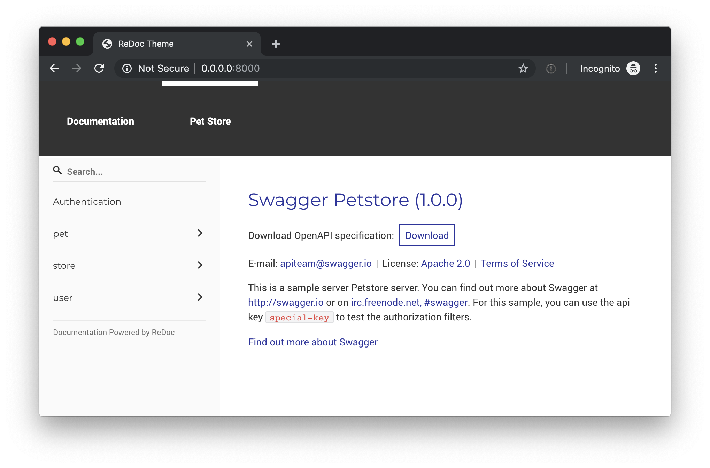

# redoc-theme

This is a repository with example of how to customize
[ReDoc](https://github.com/Redocly/redoc) with a custom navigation bar.

## Sidebar

The sidebar with titles will automatically be generated from the headers in this
file. Even the code blocks will be rendered properly.

* Example bullets
* That will be rendered nicely
* From this theme

```python
#!/usr/bin/env python

def main():
    """
    Print hello world to the screen
    """
    print("Hello, World!")


if __name__ == '__main__':
    main()
```

## Test this

To test this theme (or ReDoc at all) you need to host the files statically. The
easiest way to do this is probably to start a simple server and use that.

### Example

Browse to [localhost:8000](http://localhost:8000) after starting the server.

```sh
python3 -m http.server
```

## Screenshot

This is a screenshot of the server.


